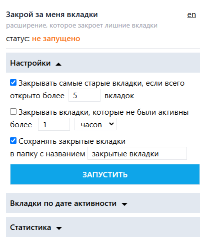
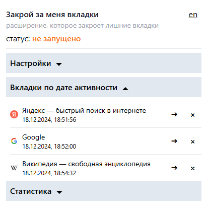
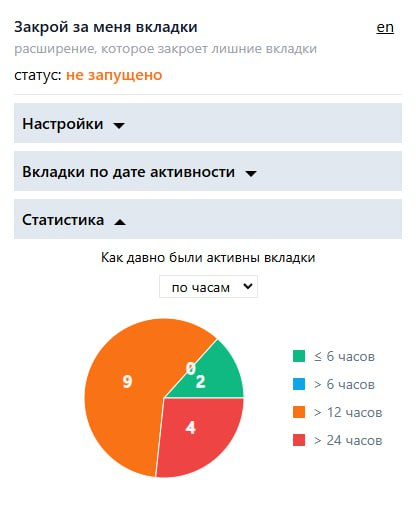

# Содержание

- [О расширении](#о-расширении)
- [Как установить](#как-установить)
- [Как использовать](#как-использовать)

## О расширении

Расширение для браузера, которое помогает закрывать вкладки тем, кто этого делать не любит.

В расширении есть 2 режима:

- закрывать самые старые вкладки по достижении n открытых вкладок
- закрывать вкладки, которые последний раз посещались более m времени назад

Эти режимы можно использовать по отдельности, можно совмещать. Кроме того, можно включить сохранение вкладок, закрытых расширением, в отдельную папку.

Кроме этого, в расширении можно также посмотреть список всех вкладок, отсортированных по времени последней активности, и при необходимости закрыть их вручную. А также можно посмотреть статистику в виде круговой диаграмы по тому, как давно вкладки были активны.

Тестировалось в Google Chrome версии 131.

## Как установить

1. [Скачать по ссылке архив](https://github.com/cswv/close-tabs-for-me/releases/tag/v1.0.0) с названием close-tabs-for-me.zip
2. Извлечь содержимое архива в любое удобное место
3. В браузере добавить расширение (в google chrome зайти в "расширения" -> "управление расширениями", выбрать "загрузить распакованное расширение" и выбрать папку dist, которая была извлечена из архива)

## Как использовать

В расширении есть 3 раздела - настройки, вкладки по дате активности и статистика. Можно нажать на любой из них, чтобы развернуть соответствующий раздел.

Можно также поменять язык нажав на переключатель en, либо ру (в зависимости от выбранного сейчас языка).

### Настройки

В разделе настроек можно выбрать нужный режим закрытия вкладок, либо сразу несколько - для этого нужно поставить галочки напротив нужных опций, задать необходимые настройки и нажать кнопку "запустить".

После запуска можно в любой момент остановить работу расширения, для этого достаточно в этом же меню нажать на кнопку "остановить" (которая сменит кнопку "запустить" после запуска).

---

### Список вкладок по активности

В разделе списка вкладок можно посмотреть все вкладки, отсортированные по времени последней активности. Время последней активности также указано под названием вкладки.

По нажатию на кнопку с изображением стрелочки можно перейти к выбранной вкладке, по нажатию на кнопку с крестиком можно закрыть указанную вкладку.

---

### Статистика

В разделе статистики можно посмотреть статистику по часам, либо по дням в зависимости от выбранной опции. Статистика представляет из себя круговую диаграмму, на которой учитываются открытые в данный момент вкладки, и показывает распределение на данный момент, какое количество вкладок как давно были активны.
